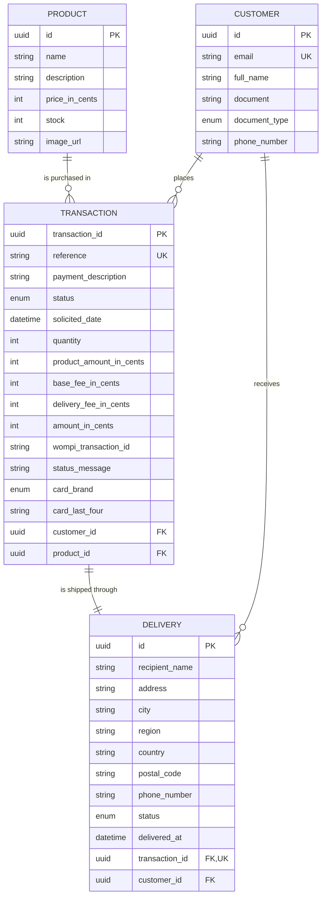

# ms-payments

Backend API for a single-product checkout flow paid with a credit card through a
sandbox payment gateway. Built with **NestJS + TypeScript**, **PostgreSQL** and
**Prisma**, following **Hexagonal Architecture (Ports & Adapters)** and
**Railway Oriented Programming** in the use cases.

> Companion frontend: `fe-payments` (SPA).

---

## Table of contents

- [Architecture](#architecture)
- [Data model](#data-model)
- [Business flow](#business-flow)
- [API reference](#api-reference)
- [Getting started](#getting-started)
- [Testing and coverage](#testing-and-coverage)
- [Security](#security)
- [Deployment](#deployment)

---

## Architecture

Business logic never lives in the routing layer. Controllers only translate HTTP
into use-case calls and back.

```
                inbound                                    outbound
                   |                                          |
  HTTP  ──▶  ProductsController          ┌─▶ PostgresProductRepository ──▶ PostgreSQL
             TransactionsController      │   PostgresCustomerRepository
                   |                     │   PostgresTransactionRepository
                   ▼                     │   PostgresDeliveryRepository
            ┌──────────────┐             │
            │  USE CASES   │  ports ─────┤
            │    (ROP)     │             │
            └──────────────┘             └─▶ WompiPaymentGatewayAdapter ──▶ Gateway API
                   |
                   ▼
            ┌──────────────┐
            │    DOMAIN    │  entities, enums, pure services, DomainError
            └──────────────┘
```

### Folder structure

```
src/
├── domain/                              # Pure business core. No framework, no I/O.
│   ├── models/                          # Product, Customer, Transaction, Delivery
│   ├── resources/                       # Enums and commercial constants
│   ├── services/                        # CardBrandService, AmountCalculatorService
│   └── errors/                          # DomainError discriminated union
│
├── application/
│   ├── ports/                           # Outbound interfaces (repositories, gateway)
│   ├── use-cases/                       # Orchestration written as ROP pipelines
│   └── injections/                      # NestJS modules binding ports to adapters
│
├── infrastructure/
│   ├── entrypoints/rest/                # Controllers, DTOs, HTTP mapping helpers
│   └── outpoints-adapters/
│       ├── postgres/                    # Prisma repositories and row/model mappers
│       └── external-services/           # Payment gateway HTTP adapter
│
├── runner/                              # main.ts and the root module
└── utilities/                           # Cross-cutting helpers
```

### Railway Oriented Programming

Every use case returns `ResultAsync<T, DomainError>` (via
[`neverthrow`](https://github.com/supermacro/neverthrow)). A failure short-circuits
the rest of the pipeline instead of throwing, and only the REST edge
(`unwrapOrThrow`) converts a `DomainError` into an HTTP status:

| DomainErrorCode                 | HTTP |
| ------------------------------- | ---- |
| `PRODUCT_NOT_FOUND`             | 404  |
| `TRANSACTION_NOT_FOUND`         | 404  |
| `INSUFFICIENT_STOCK`            | 409  |
| `TRANSACTION_ALREADY_FINALIZED` | 409  |
| `INVALID_CARD`                  | 422  |
| `INVALID_QUANTITY`              | 422  |
| `GATEWAY_ERROR`                 | 502  |
| `PERSISTENCE_ERROR`             | 500  |

---

## Data model



### Design decisions

| Decision                                | Rationale                                                                                             |
| --------------------------------------- | ----------------------------------------------------------------------------------------------------- |
| Money stored as **integer cents**       | Avoids floating-point drift and matches the gateway contract (`amount_in_cents`).                       |
| `TransactionStatus` mirrors the gateway | `PENDING / APPROVED / DECLINED / VOIDED / ERROR`. No translation table needed.                          |
| Amount breakdown persisted              | Fees may change; historic transactions must stay auditable.                                             |
| `Customer` normalised by email          | Repeat buyers reuse a single record instead of duplicating identity data on every transaction.          |
| `Delivery` is 1:1 with `Transaction`    | Each purchase ships exactly once; the unique FK enforces it at database level.                          |
| Only `card_brand` + `card_last_four`    | PAN, CVC and expiry are never persisted. Raw card data exists in memory only during tokenisation.       |
| Conditional stock decrement             | `WHERE stock >= quantity` makes the update atomic, so concurrent checkouts cannot oversell.             |

### Transaction states

| State      | Meaning                                                    |
| ---------- | ---------------------------------------------------------- |
| `PENDING`  | Created locally, payment not yet resolved.                  |
| `APPROVED` | Charge accepted. Stock decremented and delivery assigned.   |
| `DECLINED` | Rejected by the issuing bank. Stock untouched.              |
| `VOIDED`   | Cancelled before settlement.                                |
| `ERROR`    | Gateway or network failure. Never leaves a stuck `PENDING`. |

---

## Business flow

1. `GET /api/products` — the SPA renders the catalogue with live stock.
2. The customer fills in card and delivery data (validated client- and server-side).
3. The summary shows product amount + base fee + delivery fee.
4. `POST /api/transactions` — persists a **PENDING** transaction, its customer and
   its delivery, and returns the transaction number.
5. `POST /api/transactions/:id/payment` — tokenises the card, signs the request,
   charges the gateway and polls until a final status. On `APPROVED` the delivery
   is assigned and stock is decremented, both inside the same use case.
6. `GET /api/transactions/:id` — lets the SPA restore the result after a refresh.

If the gateway resolves a transaction after the synchronous call has returned,
it notifies `POST /api/webhooks/payments`. Both paths converge on the same
`TransactionFulfillmentService`, so the outcome is applied exactly once.

---

## API reference

Interactive Swagger UI, publicly available:

- **<https://ms-payments-1.onrender.com/api/docs>**
- OpenAPI JSON: <https://ms-payments-1.onrender.com/api/docs-json>

> First request may take up to ~50 seconds: Render's free tier suspends the
> service after 15 minutes of inactivity and needs to wake it up.

| Method | Endpoint                        | Description                                     |
| ------ | ------------------------------- | ----------------------------------------------- |
| GET    | `/api/health`                   | Liveness probe.                                 |
| GET    | `/api/products`                 | Catalogue with available stock.                 |
| GET    | `/api/products/:id`             | Single product.                                 |
| POST   | `/api/transactions`             | Create a PENDING transaction + customer + delivery. |
| POST   | `/api/transactions/:id/payment` | Charge the card and finalise the transaction.   |
| GET    | `/api/transactions/:id`         | Current transaction state.                      |
| POST   | `/api/webhooks/payments`        | Gateway events. Signature-verified, idempotent. |

---

## Getting started

### Prerequisites

Node.js 20+, Docker Desktop.

### Steps

```bash
# 1. Install dependencies
npm install

# 2. Configure the environment
cp .env.example .env      # then fill in the gateway keys

# 3. Start PostgreSQL
docker compose up -d

# 4. Create the schema and generate the typed client
npm run prisma:migrate -- --name init
npm run prisma:generate

# 5. Seed the dummy products
npm run db:seed

# 6. Run the API
npm run start:dev         # http://localhost:3000/api/docs
```

---

## Testing and coverage

```bash
npm test          # unit tests
npm run test:cov  # coverage report (fails below 80%)
```

Jest enforces a hard **80% threshold** on branches, functions, lines and
statements. Modules that contain no logic (NestJS modules, DTOs, ports, enums,
test fixtures and `main.ts`) are excluded from the metric.

**Result: 155 tests across 29 suites, all passing.**

| Metric     | Coverage | Threshold |
| ---------- | -------- | --------- |
| Statements | 98.68%   | 80%       |
| Branches   | 86.32%   | 80%       |
| Functions  | 96.89%   | 80%       |
| Lines      | 98.53%   | 80%       |

```
-----------------------------------------------------|---------|----------|---------|---------
File                                                 | % Stmts | % Branch | % Funcs | % Lines
-----------------------------------------------------|---------|----------|---------|---------
All files                                            |   98.68 |    86.32 |   96.89 |   98.53
 application/services                                |     100 |      100 |     100 |     100
 application/use-cases                               |   99.23 |    91.83 |     100 |   99.14
 domain/errors                                       |     100 |      100 |     100 |     100
 domain/models                                       |     100 |      100 |     100 |     100
 domain/services                                     |   98.07 |    93.54 |     100 |   98.03
 infrastructure/entrypoints/rest/controllers         |     100 |       75 |     100 |     100
 infrastructure/entrypoints/rest/utilities           |     100 |       95 |     100 |     100
 infrastructure/outpoints-adapters/external-services |   96.87 |    96.77 |   92.85 |   96.55
 infrastructure/outpoints-adapters/postgres          |    96.7 |    73.68 |   91.66 |   96.05
 utilities                                           |     100 |      100 |     100 |     100
-----------------------------------------------------|---------|----------|---------|---------
```

### What is covered

- **Domain** — Luhn validation, VISA/Mastercard detection (including the
  2221-2720 range), fee breakdown, transaction state rules, and the webhook
  signature algorithm with tampered-amount and foreign-secret cases.
- **Use cases** — every failure branch: missing product, insufficient stock,
  invalid card, already finalized transaction, orphaned customer, and a gateway
  outage that must leave the transaction in `ERROR` rather than stuck in
  `PENDING`.
- **Persistence adapters** — all four repositories against a mocked Prisma
  client, including the conditional `stock >= quantity` update that prevents
  overselling.
- **Gateway adapter** — the full handshake with a mocked `fetch`: acceptance
  token, tokenisation, integrity signature, status polling, exhausted retries,
  HTTP errors, network failures and malformed JSON. One test asserts that the
  card number never appears in the transaction request body.

## Security

- Secrets are read from environment variables; `.env` is git-ignored.
- The gateway **private** and **integrity** keys are server-side only and are
  never returned to the SPA.
- Card PAN, CVC and expiry date are never persisted or logged; only the brand
  and the last four digits are stored.
- `helmet` sets the OWASP security headers; CORS is restricted through
  `CORS_ORIGINS`.
- `ValidationPipe` runs with `whitelist` and `forbidNonWhitelisted`, so unknown
  properties are rejected instead of silently accepted.
- Integrity signature: `SHA-256(reference + amount_in_cents + currency + secret)`.
- Webhook events are rejected unless their checksum matches
  `SHA-256(signed_properties + timestamp + events_secret)`, compared in constant
  time. Events for unknown or already finalized transactions are acknowledged
  without side effects, so replaying them changes nothing.

---

## Deployment

| Component  | Provider      | URL                                              |
| ---------- | ------------- | ------------------------------------------------ |
| API        | Render        | <https://ms-payments-1.onrender.com>             |
| Swagger    | Render        | <https://ms-payments-1.onrender.com/api/docs>    |
| SPA        | Render        | <https://fe-payments.onrender.com>               |
| Database   | Neon          | Managed PostgreSQL 17 (`us-west-2`)              |

Frontend repository: <https://github.com/jportilla288/fe-payments>

### Notes for reviewers

- **Cold start.** The free Render instance sleeps after 15 minutes idle, so the
  first request of a session can take ~50 seconds. Subsequent requests are fast.
- **Branch strategy.** `feature/*` → `dev` → `qa` → `uat` → `main`. Production
  deploys from `main` on every merge.
- **Test cards.** `4242 4242 4242 4242` (VISA) and `5555 5555 5555 4444`
  (Mastercard) pass validation. A random number is rejected by the Luhn check.
- **Environment.** All secrets are injected as environment variables in Render;
  nothing sensitive is committed. See `.env.example` for the full list.
